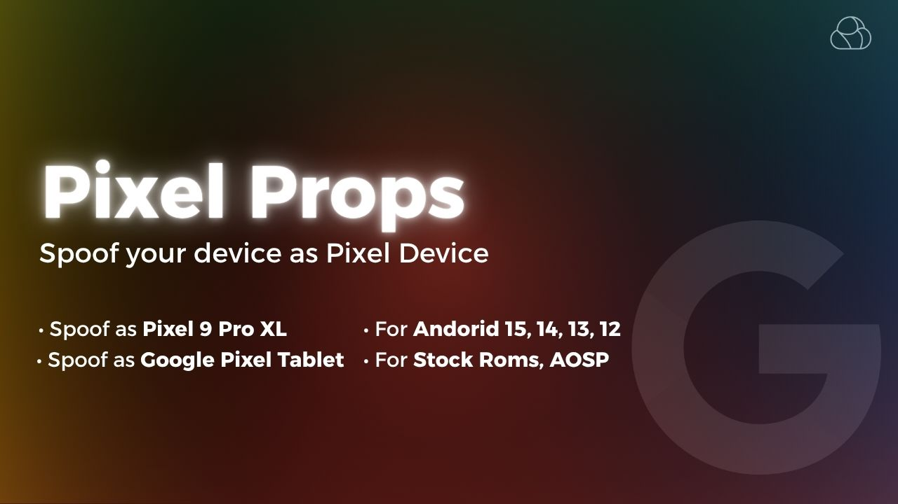

# Pixel Props

  
   

  
**Spoof your device as Pixel Device**

   
  
  

- **Support Store Roms, AOSP**

### List For Devices that included in Module:

- Pixel 9 Pro XL 
   - Android 12
   - Android 13
   - Android 14
   - Android 15

- Google Pixel Tablet
   - Android 12
   - Android 13
   - Android 14
   - Android 15

### Follow: [MRX7014 Cloud](https://t.me/mrx7014cloud)
